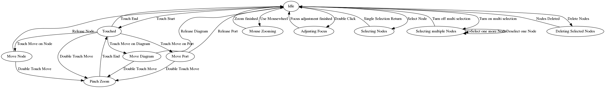

# TouchGraph

Fun project with d3 and typescript


## States and Transitions

As a little experiment, user interactions are controlled by a state machine.

States and Transitions are saved in a dot file which can be easily
converted into a graphic to get a nice overview which events and transitions
exist and in which relation they are to each other on the one hand.
The idea here is to keep track of simple interactions as well as multi step workflows
visually and programmatically.


Graphic was created with **dot** under linux.
```bash
dot -Tpng input.dot > output.png
```

hinti: 
install graphviz to get the dot command:
```bash
sudo apt install graphviz
```